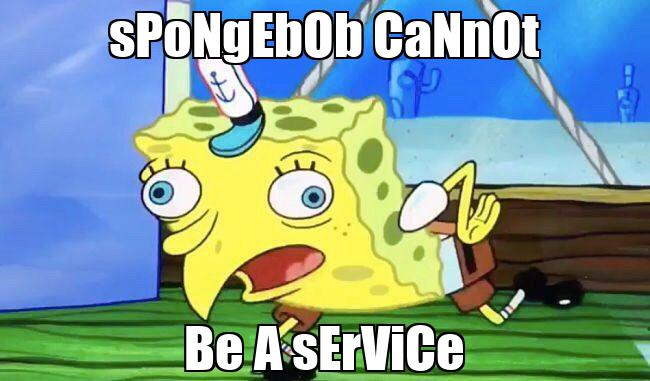

# spongebob-as-a-service

Converting the SpongeBob Mocking Meme into a Service to redefine the meaning of SaaS.

<p align="center">
  
</p>

# How to use SaaS

SaaS is pretty simple to use, and aims to be the simplest (and only) SpongeBob service that exists.

The base url format is ```https://spongebob-service.herokuapp.com/``` and shall be referred to as simply `base`. 

SaaS memes can be generated using the following URL requests:

* Bottom Caption: This will insert a caption at the bottom.

```base/caption```

* Top and Bottom Captions: This will insert a caption at the top.

```base/top_caption/bottom_caption```


You can even use SaaS in a script. Here is a simple example using Python.

```Python
>>> import requests
>>> from bs4 import BeautifulSoup
>>> 
>>> base_url  = "https://spongebob-service.herokuapp.com/"
>>> meme_url = "https://spongebob-service.herokuapp.com/yOu CaNnOt/CoDe MeMes"
>>> 
>>> response = requests.get(meme_url)
>>> 
>>> soup = BeautifulSoup(response.text, 'html.parser')
>>> img_tags = soup.find_all('img')
>>> 
>>> img_url = img_tags[0]["src"]
>>> img_url = base_url + img_url
>>> 
>>> response = requests.get(img_url)
>>> with open("meme.jpg", 'wb') as outfile:
>>>     outfile.write(response.content)
```

Support for specifying caption positions coming soon.

# Inspiration to convert the SpongeBob Mocking Meme into a Service

My dear friend Ryan (name changed) scoffed and said that I cannot make a service out of everything I see. After hearing such a preposterous claim, (and the critically acclaimed asuccess of my [AaaS](https://github.com/aditeyabaral/arithmetic-as-a-service)) I just had to prove him wrong. Guess who is is laughing now, Ryan.

# Contributing to SaaS

Contributions are welcome to include more SpongeBob memes and cleaner code.
